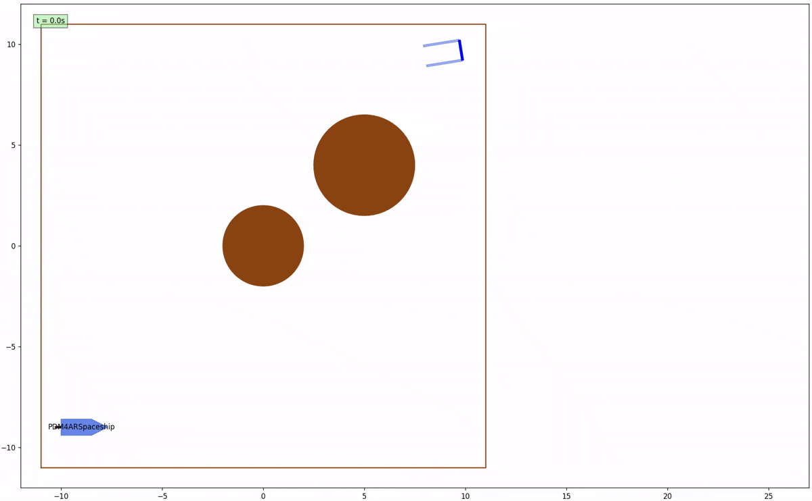

<h1 id="about" class="small-title" style="padding-top: 40px; margin-top: -50px;">Grüezi!</h1>

    I am a currently a graduate student in <a href="https://ethz.ch/en/studies/master/degree-programmes/engineering-sciences/robotics-systems-and-control.html" style="color:rgb(33, 140, 227); text-decoration: none;" target="_blank">Robotics, Systems & Control</a> at <a href="https://ethz.ch/en.html" style="color:rgb(33, 140, 227); text-decoration: none;" target="_blank">ETH, Zurich</a>. My research interests focus on Reinforcement Learning, Computer Vision and Sequence Modelling (State-Space Models).

    Over the course of my Master's degree, I have had the opportunity to implement learning algorithms for complex computer vision tasks in both pixel-based and event-based domains and for dynamic real world tasks such as autonomous drone racing at the <a href="https://rpg.ifi.uzh.ch/" style="color:rgb(33, 140, 227); text-decoration: none;" target="_blank">Robotics and Percpetion Group</a> in <a href="https://www.uzh.ch/en.html" style="color:rgb(33, 140, 227); text-decoration: none;" target="_blank">University of Zurich</a> under <a href="https://rpg.ifi.uzh.ch/people_scaramuzza.html" style="color:rgb(33, 140, 227); text-decoration: none;" target="_blank">Prof. Davide Scaramuzza</a>.

    Prior to my Masters, I completed my <a href="https://www.hw.ac.uk/dubai/study/undergraduate/mechanical-engineering" style="color:rgb(33, 140, 227); text-decoration: none;" target="_blank">BEng (Hons) in Mechanical Engineering</a> at <a href="https://www.hw.ac.uk/dubai/" style="color:rgb(33, 140, 227); text-decoration: none;" target="_blank">Heriot-Watt University, Dubai</a>; I was awarded with the <a href="https://www.hw.ac.uk/alumni/watt-club/medals-prizes.htm" style="color:rgb(33, 140, 227); text-decoration: none;" target="_blank">Watt Club Medal</a> and <a href="https://www.hw.ac.uk/alumni/watt-club/medals-prizes.htm" style="color:rgb(33, 140, 227); text-decoration: none;" target="_blank">The James Anderson Memorial Prize</a>.

 

<h2 id="projects" class="small-title" style="padding-top: 40px; margin-top: -50px;">Projects</h2>

    

        
<strong>State Space Models for Efficient Reinforcement Learning in Quadrotors</strong>

        
Proposed the first SSM-based RL framework for Autonomous Drone Racing for both state-based and vision-based domains. Developed a custom PPO JAX-Implementation to train the drone racing policies for the <a href="https://uzh-rpg.github.io/flightmare/" style="color:rgb(33, 140, 227); text-decoration: none;" target="_blank">Flightmare Simulator</a>. Achieved SOTA performance – 8-10% faster lap-times in comparison to existing drone racing policies on the Flightmare Simulator by effectively capturing and utilizing the rich temporal information embedded in the drone racing environment. (Code - Soon!)

    

        

        
        
    

        

        
        
        
        
    

    

        
<strong>Pushing the limits of Optical Flow Estimation in Event Cameras</strong>

        
Proposed the first multi-event learning based optical flow framework for event-based vision. Achieved SOTA performance on event-based optical flow benchmarks such as <a href="https://dsec.ifi.uzh.ch/" style="color:rgb(33, 140, 227); text-decoration: none;" target="_blank">DSEC-Flow</a> and <a href="https://daniilidis-group.github.io/mvsec/" style="color:rgb(33, 140, 227); text-decoration: none;" target="_blank">MVSEC</a>. (Code - Soon!)

    

    

        
<strong>Spaceship Obstacle Avoidance and Trajectory Planning</strong>

        
Implemented a <a href="https://arxiv.org/abs/2106.09125" style="color:rgb(33, 140, 227); text-decoration: none;" target="_blank">SCvx (Successive Convexification)</a> planning and control algorithm for a spaceship to effectively avoid static obstacles (planets) & dynamic obstacles (satellites) and to dock with the docking station. (Code - Soon!)

    

        

        
        
    

        

        
        
        
        
    

    

        
<strong>Robust Soccer Ball Detection and Tracking (FIFA) </strong>

        
Developed a pipeline to generalize detection and tracking of soccer balls across both blurred and non-blurred frames. Utilized <a href="https://research.google/blog/introducing-google-research-football-a-novel-reinforcement-learning-environment/" style="color:rgb(33, 140, 227); text-decoration: none;" target="_blank">Google Research Football Simulator</a> to extract dataset which was used to train a <a href="https://docs.ultralytics.com/models/yolov8/" style="color:rgb(33, 140, 227); text-decoration: none;" target="_blank">YOLOv8n</a> model to accurately detect soccer balls. Integrated the trained network with an existing state-of-the art approach <a href="https://arxiv.org/abs/2111.14465" style="color:rgb(33, 140, 227); text-decoration: none;" target="_blank">MfB (Motion from Blur)</a> to track fast moving blurry objects across frames. Obtained the ball detections from the (YOLOv8n + MfB) model for a custom FIFA dataset and combined it with camera pose information to triangulate the position of the ball and subsequently generated trajectories of the soccer ball. (Code - Soon!)

    

